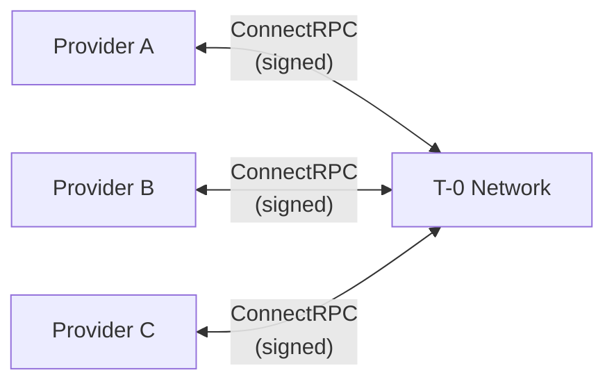
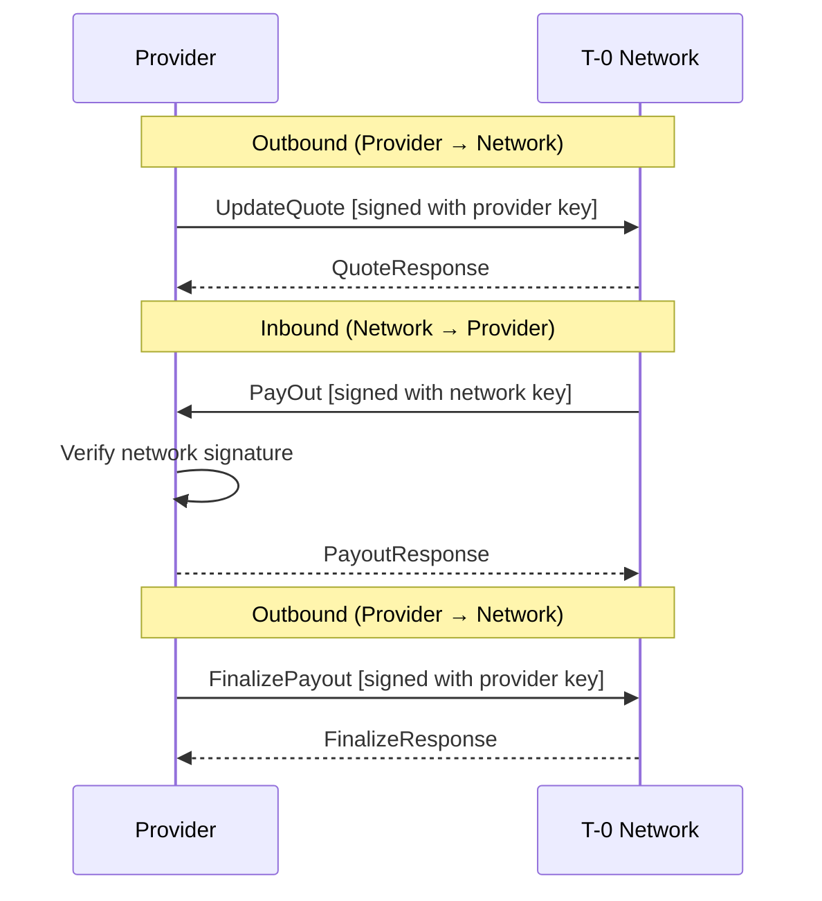
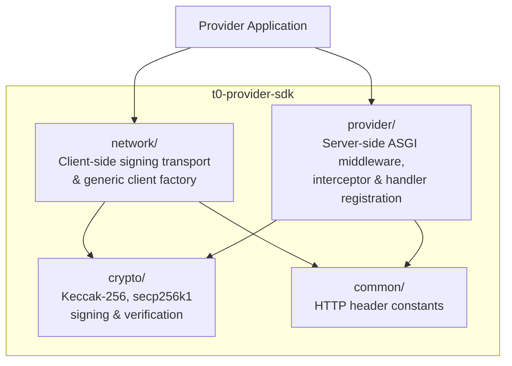
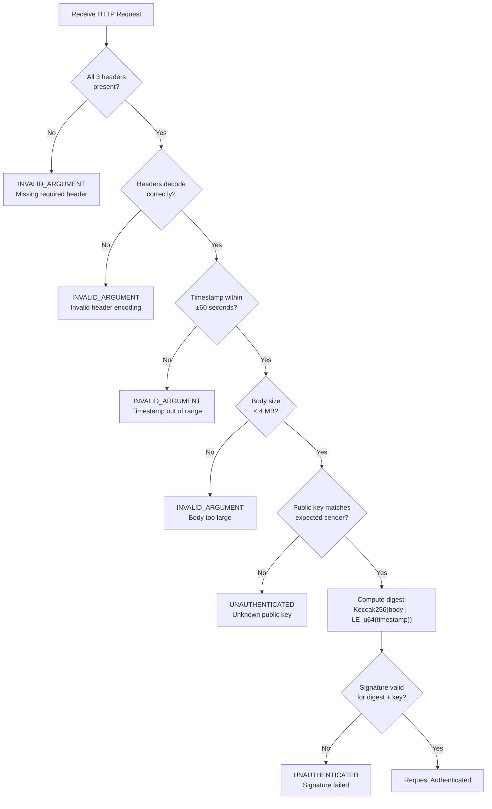
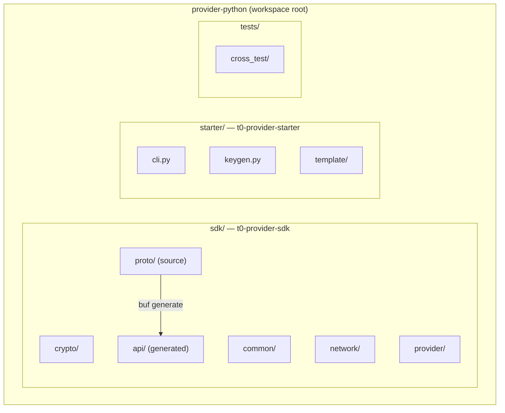
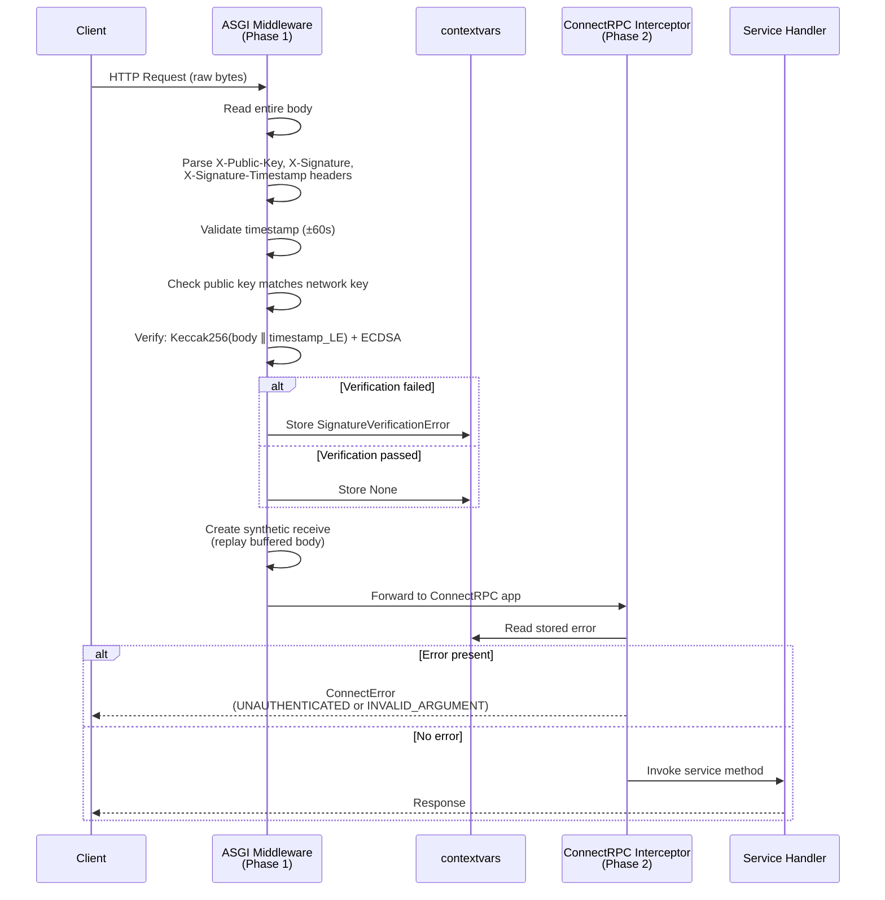
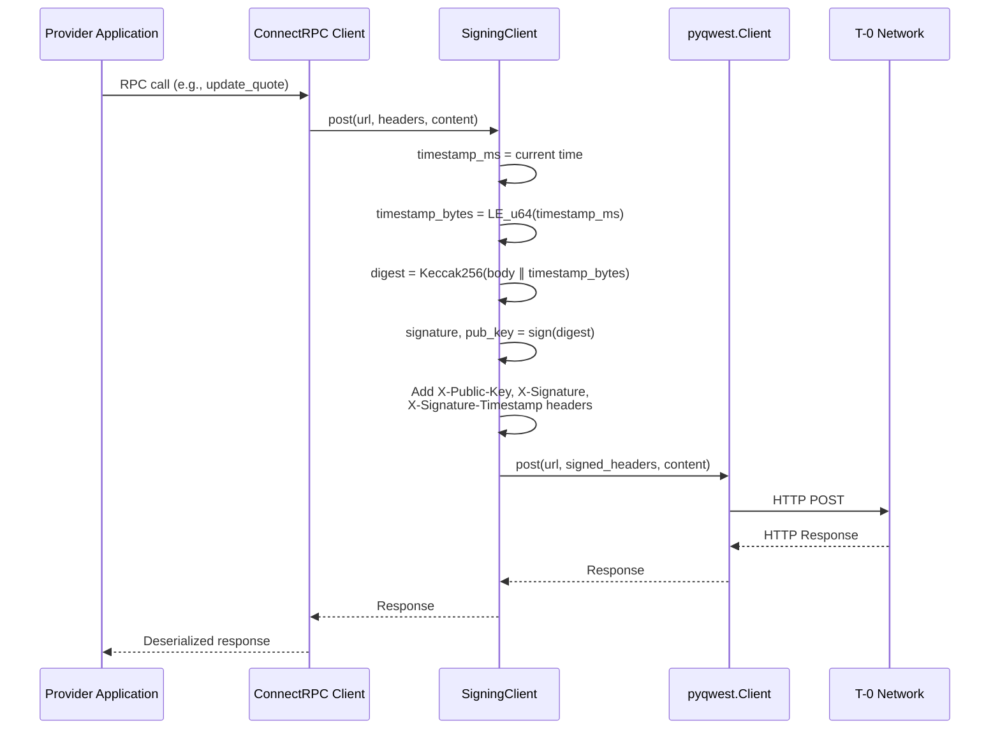
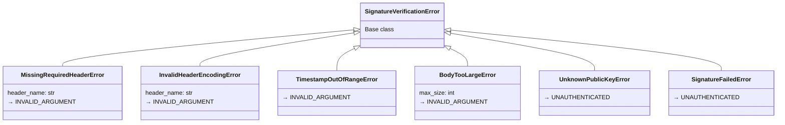
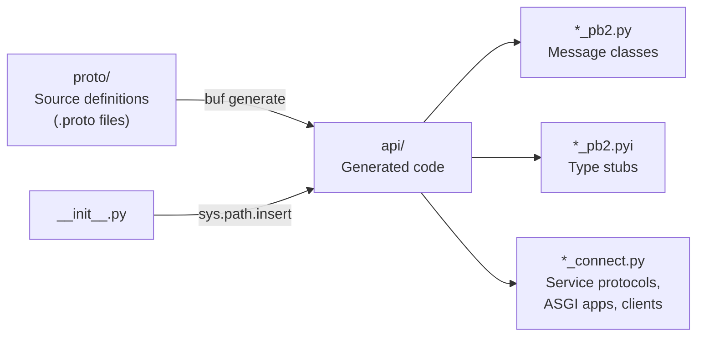

# T-0 Provider Python SDK -- Architecture

---

## Table of Contents

1. [System Overview](#1-system-overview)
   - 1.1 [The T-0 Network](#11-the-t-0-network)
   - 1.2 [Role of the Python Provider SDK](#12-role-of-the-python-provider-sdk)
   - 1.3 [Key Concepts](#13-key-concepts)
   - 1.4 [Communication Model](#14-communication-model)
   - 1.5 [SDK Architecture at a Glance](#15-sdk-architecture-at-a-glance)
2. [Protocol Specification](#2-protocol-specification)
   - 2.1 [Signature Protocol](#21-signature-protocol)
   - 2.2 [Error Classification](#22-error-classification)
   - 2.3 [RPC Service Definitions](#23-rpc-service-definitions)
   - 2.4 [Transport Protocol](#24-transport-protocol)
3. [Architecture and Design Decisions](#3-architecture-and-design-decisions)
   - 3.1 [Technology Stack](#31-technology-stack)
   - 3.2 [Package Architecture](#32-package-architecture)
   - 3.3 [Server-Side: Two-Phase Verification](#33-server-side-two-phase-verification)
   - 3.4 [Client-Side: Signing Transport](#34-client-side-signing-transport)
   - 3.5 [Proto-Agnostic Design](#35-proto-agnostic-design)
   - 3.6 [Error Hierarchy Design](#36-error-hierarchy-design)
   - 3.7 [Go SDK Correspondence](#37-go-sdk-correspondence)
   - 3.8 [Protobuf Code Generation Pipeline](#38-protobuf-code-generation-pipeline)
   - 3.9 [Starter CLI and Template Architecture](#39-starter-cli-and-template-architecture)
4. [Implementation Reference](#4-implementation-reference)
   - 4.1 [Cryptographic Primitives (`crypto/`)](#41-cryptographic-primitives-crypto)
   - 4.2 [Shared Constants (`common/`)](#42-shared-constants-common)
   - 4.3 [Client-Side Transport (`network/`)](#43-client-side-transport-network)
   - 4.4 [Server-Side Framework (`provider/`)](#44-server-side-framework-provider)
   - 4.5 [Generated Code (`api/`)](#45-generated-code-api)
   - 4.6 [Starter CLI (`t0-provider-starter`)](#46-starter-cli-t0-provider-starter)
   - 4.7 [Testing Architecture](#47-testing-architecture)
   - 4.8 [Development Guide](#48-development-guide)

---

## 1. System Overview

### 1.1 The T-0 Network

The T-0 Network is a payment settlement system that connects payment providers -- banks, payment service providers (PSPs), and FX brokers -- through cryptographically authenticated remote procedure calls. The network operates on a bilateral trust model where every request between parties is authenticated using secp256k1 ECDSA digital signatures over Keccak-256 message digests.

Each participant in the network holds a secp256k1 keypair. Outgoing requests are signed with the sender's private key, and incoming requests are verified against the expected sender's public key. This ensures message integrity and sender authentication without relying on TLS client certificates or shared secrets.



### 1.2 Role of the Python Provider SDK

The Python Provider SDK (`t0-provider-sdk`) handles all cryptographic, transport, and protocol machinery so that provider developers can focus exclusively on business logic. It provides:

- **Server-side middleware** that verifies incoming request signatures from the T-0 Network
- **Client-side transport** that signs outgoing requests to the T-0 Network
- **Cryptographic utilities** for Keccak-256 hashing and secp256k1 ECDSA signing/verification
- **Generic, proto-agnostic** handler and client factories for ConnectRPC services

The SDK is a faithful port of the Go SDK (the golden standard), ensuring binary-compatible signatures and cross-language interoperability. A companion package, `t0-provider-starter`, provides a CLI tool that scaffolds complete provider projects with a single command.

### 1.3 Key Concepts

| Term | Definition |
|------|-----------|
| **Provider** | A payment service provider integrated with the T-0 Network |
| **ProviderService** | The server-side RPC service that the T-0 Network calls on the provider (inbound) |
| **NetworkService** | The client-side RPC service that the provider calls on the T-0 Network (outbound) |
| **Signature Protocol** | The Keccak-256 + secp256k1 ECDSA message authentication scheme |
| **ConnectRPC** | The RPC framework used for communication (HTTP/1.1 and HTTP/2 compatible, not gRPC) |
| **Raw Payload Bytes** | The original HTTP request body bytes as they appear on the wire |
| **Network Public Key** | The T-0 Network's secp256k1 public key, used to verify inbound requests |
| **Provider Private Key** | The provider's secp256k1 private key, used to sign outbound requests |

### 1.4 Communication Model

Communication between a provider and the T-0 Network is bidirectional. Both sides initiate calls and both sides authenticate requests using the same signature protocol.

**Inbound (Network calls Provider):** The T-0 Network sends signed requests to the provider's `ProviderService`. The provider's SDK middleware verifies the network's signature before the request reaches the service handler.

**Outbound (Provider calls Network):** The provider sends signed requests to the network's `NetworkService`. The SDK's signing transport automatically signs each request with the provider's private key.



### 1.5 SDK Architecture at a Glance

The SDK is organized into four module groups, each with a clear responsibility and minimal coupling:



| Module | Responsibility |
|--------|---------------|
| `crypto/` | Keccak-256 hashing, secp256k1 key management, ECDSA signing and verification |
| `common/` | HTTP header name constants shared between client and server |
| `network/` | Signing HTTP transport wrapper and generic ConnectRPC client factory |
| `provider/` | ASGI signature verification middleware, ConnectRPC error interceptor, and generic handler registration |

---

## 2. Protocol Specification

This chapter defines the T-0 Network signature protocol as a language-independent specification. No implementation details, libraries, or code are referenced here.

### 2.1 Signature Protocol

#### 2.1.1 Message Construction

Every HTTP request body is authenticated by computing a digital signature over the body bytes concatenated with a timestamp. The message is constructed as follows:

```
message = body || timestamp
```

Where:
- **`body`** is the raw HTTP request body (0 to 4,194,304 bytes by default). These MUST be the exact bytes on the wire. Protobuf serialization is not canonical -- deserializing and re-serializing a Protobuf message can produce different bytes. The signing and verification layers must operate on the original wire bytes, never on re-serialized output.
- **`timestamp`** is the current time in milliseconds since the Unix epoch, encoded as a **little-endian unsigned 64-bit integer** (8 bytes).

```
Message byte layout:
┌──────────────────────┬─────────────────────────┐
│ body bytes           │ timestamp (8 bytes)      │
│ (0 .. 4,194,304)     │ little-endian uint64     │
└──────────────────────┴─────────────────────────┘
```

> **CRITICAL INVARIANT:** The body bytes used for signing and verification MUST be the exact bytes from the HTTP request. Re-encoding a deserialized Protobuf message produces different bytes and will cause signature verification to fail.

#### 2.1.2 Digest Computation

The message is hashed using **legacy Keccak-256** (the pre-NIST Keccak variant used in the Ethereum ecosystem). The output is always 32 bytes.

| Property | Keccak-256 (used) | SHA-3-256 (NOT used) |
|----------|-------------------|---------------------|
| Padding | Multi-rate (0x01) | Domain-separated (0x06) |
| Hash of empty input | `c5d2460186f7233c...` | `a7ffc6f8bf1ed766...` |
| Ecosystem | Ethereum, secp256k1 | NIST standard |

> **WARNING:** NIST SHA-3-256 and legacy Keccak-256 produce different outputs for the same input due to different padding schemes. They are not interchangeable.

#### 2.1.3 Signature Generation

The 32-byte digest is signed using **secp256k1 recoverable ECDSA**. The signing function receives a pre-hashed digest (no additional hashing is performed internally). The signature format is:

```
signature = r (32 bytes) || s (32 bytes) || v (1 byte)
```

Where `v` is the recovery ID (0 or 1), enabling public key recovery from the signature. The total signature length is **65 bytes**.

The signer also outputs the **uncompressed public key** (65 bytes: `0x04 || x(32) || y(32)`) for inclusion in the request headers.

#### 2.1.4 HTTP Header Encoding

Three HTTP headers carry the authentication data on every request:

| Header | Format | Length | Example |
|--------|--------|--------|---------|
| `X-Public-Key` | `0x` + hex(public_key_65_bytes) | 132 chars | `0x04fa1465c0...` |
| `X-Signature` | `0x` + hex(signature_65_bytes) | 132 chars | `0x304502210...` |
| `X-Signature-Timestamp` | Decimal string of milliseconds | 13+ chars | `1700000000000` |

All hex-encoded values use lowercase hexadecimal characters and include the `0x` prefix.

#### 2.1.5 Verification Procedure

The receiving party verifies an incoming request through the following steps:



Verification uses public key **recovery**: the public key is recovered from the signature and digest, then compared to the expected sender's public key. If the signer receives a 64-byte signature (without the recovery byte), both possible recovery IDs (0 and 1) are tried.

### 2.2 Error Classification

Signature verification errors fall into two categories based on the nature of the failure:

| Error Condition | ConnectRPC Code | Category |
|----------------|-----------------|----------|
| Missing required header | `INVALID_ARGUMENT` | Malformed request |
| Invalid header encoding | `INVALID_ARGUMENT` | Malformed request |
| Timestamp out of range | `INVALID_ARGUMENT` | Clock drift / replay |
| Body too large | `INVALID_ARGUMENT` | Size constraint |
| Unknown public key | `UNAUTHENTICATED` | Authentication failure |
| Signature verification failed | `UNAUTHENTICATED` | Authentication failure |

The distinction determines the appropriate response: `INVALID_ARGUMENT` indicates the request was structurally invalid, while `UNAUTHENTICATED` indicates the request could not be authenticated.

### 2.3 RPC Service Definitions

#### 2.3.1 ProviderService (Inbound)

The T-0 Network calls these RPCs on the provider. All methods are idempotent.

| RPC | Purpose |
|-----|---------|
| `PayOut` | Network instructs the provider to execute a payout to a recipient |
| `UpdatePayment` | Status update on a payment the provider initiated |
| `UpdateLimit` | Notification of changes to the provider's limits |
| `AppendLedgerEntries` | New ledger transactions and entries |
| `ApprovePaymentQuotes` | Last-look quote approval request after AML check |

#### 2.3.2 NetworkService (Outbound)

The provider calls these RPCs on the T-0 Network.

| RPC | Purpose |
|-----|---------|
| `UpdateQuote` | Publish pay-out and pay-in quotes with rate bands |
| `GetQuote` | Request a quote for a specific currency and payment method |
| `FinalizePayout` | Report the outcome of a payout (success with receipt or failure) |

### 2.4 Transport Protocol

Communication uses **ConnectRPC**, a modern RPC framework that transmits Protobuf messages over standard HTTP/1.1 or HTTP/2. Key characteristics:

- **Content-Type:** `application/proto` (binary Protobuf serialization)
- **HTTP Method:** `POST` for all unary RPCs
- **Request Path:** `/<package>.<Service>/<Method>` (e.g., `/tzero.v1.payment.ProviderService/PayOut`)
- **Compatibility:** Works behind standard HTTP load balancers and reverse proxies without gRPC-specific infrastructure

ConnectRPC was chosen over gRPC for its HTTP/1.1 compatibility, simpler deployment requirements, and native browser support.

---

## 3. Architecture and Design Decisions

### 3.1 Technology Stack

#### Core Dependencies

| Concern | Library | PyPI Name | Import | Rationale |
|---------|---------|-----------|--------|-----------|
| RPC Framework | connect-python | `connect-python>=0.8` | `connectrpc` | Official ConnectRPC Python runtime |
| HTTP Client | pyqwest | *(transitive)* | `pyqwest` | Rust-backed HTTP client; transitive dependency of connect-python |
| Protobuf | protobuf | `protobuf>=5.28` | `google.protobuf` | Standard Protocol Buffers runtime |
| ECDSA Crypto | coincurve | `coincurve>=21.0` | `coincurve` | Python bindings for libsecp256k1 |
| Keccak Hash | pycryptodome | `pycryptodome>=3.23` | `Crypto.Hash.keccak` | Legacy Keccak-256 implementation |
| CLI Framework | click | `click>=8.1` | `click` | Starter tool CLI (starter package only) |
| Env Loading | python-dotenv | `python-dotenv>=1.0` | `dotenv` | Template .env file handling (starter package only) |

#### Rejected Alternatives

| Rejected | Reason |
|----------|--------|
| `pysha3` | Incompatible with Python 3.13 |
| `hashlib.sha3_256()` | Implements NIST SHA-3, not legacy Keccak-256 (different padding) |
| `connectrpc` on PyPI | Different package (v0.0.1 by Gaudiy), not the official ConnectRPC runtime |
| Subclassing `pyqwest.Client` | Rust-backed FFI object -- subclassing is fragile and undefined |

### 3.2 Package Architecture

The repository is a **uv workspace** containing two independently publishable packages and a shared test directory:



| Package | PyPI Name | Purpose |
|---------|-----------|---------|
| `sdk/` | `t0-provider-sdk` | Core library -- crypto, transport, middleware, handler registration |
| `starter/` | `t0-provider-starter` | CLI tool -- generates new provider projects from templates |

The packages are separate because the SDK is a runtime library dependency, while the starter is a development-time CLI tool. Projects generated by the starter depend on `t0-provider-sdk` but not on `t0-provider-starter`.

Both packages require **Python 3.13+** and use **Hatchling** as the build backend.

### 3.3 Server-Side: Two-Phase Verification

The server-side signature verification uses a **two-phase architecture** to bridge the gap between raw HTTP processing and ConnectRPC's application-level interceptor system.

**Why two phases?** Signature verification MUST operate on raw HTTP body bytes (before Protobuf deserialization), but ConnectRPC's interceptor system only runs after deserialization. A single-layer approach is impossible without modifying ConnectRPC internals.



**Phase 1 -- ASGI Middleware:**
- Intercepts the raw ASGI `receive` callable to buffer the entire request body
- Parses and validates signature headers
- Verifies the ECDSA signature against the raw body bytes
- Stores any error in a `contextvars.ContextVar` (the Python equivalent of Go's `context.WithValue`)
- Creates a synthetic `receive` that replays the buffered body to downstream middleware

**Phase 2 -- ConnectRPC Interceptor:**
- Runs inside ConnectRPC's request pipeline, after Protobuf deserialization
- Reads the error (if any) from `contextvars`
- Raises a properly typed `ConnectError` with the appropriate status code
- If no error is present, proceeds to the service handler

The two phases communicate through `contextvars.ContextVar`, which is request-scoped in async Python (each ASGI request runs in its own coroutine context).

### 3.4 Client-Side: Signing Transport

On the client side, the SDK wraps the HTTP client to inject signature headers before each outgoing request. ConnectRPC Python calls exactly three methods on its HTTP client: `get()`, `post()`, and `stream()`. The signing wrapper intercepts these three methods, computes the signature, adds headers, and delegates to the real HTTP client.



**Wrapper pattern (not subclass):** `pyqwest.Client` is backed by a Rust FFI implementation. Subclassing Rust-backed Python objects is fragile and may produce undefined behavior. The wrapper pattern -- creating a class that holds a reference to the real client and delegates method calls -- is the safe and proven approach. This mirrors Go SDK's `SigningTransport` wrapping `http.RoundTripper`.

Both async (`SigningClient` wrapping `pyqwest.Client`) and sync (`SigningSyncClient` wrapping `pyqwest.SyncClient`) variants are provided.

### 3.5 Proto-Agnostic Design

The handler registration and client factory functions are **generic** -- they work with any generated ConnectRPC service without being tied to specific Protobuf definitions.

**Server side:** The `handler()` function accepts any generated `ConnectASGIApplication` class and any object implementing the corresponding service Protocol. Multiple services can be registered and composed into a single ASGI application via `new_asgi_app()`.

**Client side:** The `new_service_client()` function accepts any generated `ConnectClient` class and returns a fully configured instance with signing transport.

In Go, this genericity is achieved via generics (`Handler[T any]`, `NewServiceClient[T]`). In Python, it is achieved using `TypeVar` and duck typing through the generated Protocol classes:

```python
# Works with ANY generated ConnectRPC service -- no SDK changes needed
app = new_asgi_app(
    network_public_key,
    handler(ProviderServiceASGIApplication, my_provider_impl),
    handler(AnotherServiceASGIApplication, my_other_impl),  # multiple services
)

client = new_service_client(private_key, NetworkServiceClient)
```

### 3.6 Error Hierarchy Design

Signature verification errors form a flat hierarchy under a single base class. Each concrete error class represents one specific failure mode and maps to exactly one ConnectRPC status code.



The interceptor uses `isinstance()` checks to determine the ConnectRPC error code:
- `UnknownPublicKeyError`, `SignatureFailedError` → `Code.UNAUTHENTICATED`
- All others → `Code.INVALID_ARGUMENT`

### 3.7 Go SDK Correspondence

The Python SDK is a faithful port of the Go SDK. Each Go module maps to a Python module with equivalent functionality:

| Go SDK File | Python SDK File | Purpose |
|-------------|-----------------|---------|
| `crypto/hash.go` | `crypto/hash.py` | Keccak-256 hashing |
| `crypto/sign.go` | `crypto/signer.py` | ECDSA signing with SignFn |
| `crypto/verify_signature.go` | `crypto/verifier.py` | Signature verification |
| `crypto/helper.go` | `crypto/keys.py` | Key conversion utilities |
| `common/header.go` | `common/headers.py` | HTTP header constants |
| `network/signing_transport.go` | `network/signing.py` | Signing HTTP wrapper |
| `network/client.go` | `network/client.py` | Generic client factory |
| `provider/verify_signature.go` | `provider/middleware.py` | ASGI signature verification |
| `provider/signature_error.go` | `provider/interceptor.py` | Error-to-ConnectError conversion |
| `provider/handler.go` | `provider/handler.py` | Handler registration |

When porting changes from Go to Python (or vice versa), use this table to locate the corresponding module.

### 3.8 Protobuf Code Generation Pipeline

Proto definitions are the source of truth and live in `sdk/src/t0_provider_sdk/proto/`. The `buf` tool generates Python code into `sdk/src/t0_provider_sdk/api/`. Generated code is committed to the repository to avoid requiring the `buf` toolchain at runtime or install time.



Generated code uses absolute imports like `from tzero.v1.payment import provider_pb2`. To make these imports resolve, the SDK's `__init__.py` adds the `api/` directory to `sys.path` at import time.

**Regeneration:** When proto definitions change, regenerate with:

```bash
cd sdk
buf dep update    # Fetch/update proto dependencies
buf generate      # Regenerate Python code into api/
```

### 3.9 Starter CLI and Template Architecture

The `t0-provider-starter` package provides the `t0-provider-starter` command that generates a complete, runnable provider project:

```bash
uvx t0-provider-starter my_provider       # Create in ./my_provider/
uvx t0-provider-starter my_provider -d .  # Create in current directory
```

**Generation workflow:**

1. Validate that the target directory is empty or does not exist
2. Generate a new secp256k1 keypair using `coincurve.PrivateKey()`
3. Copy the embedded template directory to the target
4. Replace `{{PROJECT_NAME}}` placeholders in all files
5. Strip the `.template` suffix from filenames (e.g., `pyproject.toml.template` becomes `pyproject.toml`)
6. Create `.env` from `.env.example` with the generated private key
7. Print the public key and next steps

**Generated project structure:**

```
my_provider/
├── pyproject.toml          # Project config (depends on t0-provider-sdk)
├── Dockerfile              # Multi-stage build with uv + uvicorn
├── .env                    # Generated private key + defaults
├── .env.example            # Template for reference
└── src/provider/
    ├── main.py             # Async entry point with uvicorn
    ├── config.py           # Environment variable loading
    ├── publish_quotes.py   # Sample quote publishing loop
    ├── get_quote.py        # Sample quote retrieval
    └── handler/
        └── payment.py      # ProviderService stubs with TODO comments
```

The generated `main.py` demonstrates the complete initialization flow: load config, create network client with signing transport, register service handlers, start ASGI server with signature verification middleware.

---

## 4. Implementation Reference

### 4.1 Cryptographic Primitives (`crypto/`)

#### 4.1.1 `hash.py` -- Keccak-256

Computes the legacy Keccak-256 hash using `pycryptodome`.

```python
def legacy_keccak256(data: bytes) -> bytes:
    """Compute legacy Keccak-256 hash. Returns 32 bytes."""
```

Uses `Crypto.Hash.keccak` with `digest_bits=256`. This is the pre-NIST Keccak variant (Ethereum-era). Do NOT substitute with `hashlib.sha3_256()` -- the different padding produces different output.

**Known test vector:** `Keccak256(b"hello")` = `1c8aff950685c2ed4bc3174f3472287b56d9517b9c948127319a09a7a36deac8`

#### 4.1.2 `keys.py` -- Key Conversion Utilities

All functions use `coincurve.PrivateKey` and `coincurve.PublicKey`. Hex strings support the `0x` prefix.

| Function | Signature | Notes |
|----------|-----------|-------|
| `private_key_from_hex` | `(hex_key: str) -> PrivateKey` | Strips `0x` prefix if present |
| `public_key_from_hex` | `(hex_key: str) -> PublicKey` | Accepts compressed (33B) or uncompressed (65B) |
| `public_key_to_bytes` | `(key: PublicKey) -> bytes` | Returns 65-byte uncompressed: `04 ∥ x(32) ∥ y(32)` |
| `public_key_from_bytes` | `(data: bytes) -> PublicKey` | Accepts compressed or uncompressed format |

#### 4.1.3 `signer.py` -- ECDSA Signing

Defines the `SignFn` Protocol and provides factory functions for creating signers.

```python
class SignFn(Protocol):
    def __call__(self, digest: bytes) -> tuple[bytes, bytes]:
        """Sign a 32-byte digest. Returns (signature_65B, public_key_65B)."""
        ...
```

| Function | Signature | Notes |
|----------|-----------|-------|
| `new_signer` | `(private_key: PrivateKey) -> SignFn` | Creates a signing closure |
| `new_signer_from_hex` | `(hex_key: str) -> SignFn` | Convenience: hex key → signer |

Key implementation details:
- Uses `coincurve.PrivateKey.sign_recoverable(digest, hasher=None)`
- `hasher=None` means the digest is pre-hashed (no double-hashing)
- Returns `r(32) ∥ s(32) ∥ v(1)` = 65 bytes (Ethereum wire format)
- The public key is computed once in the factory and captured in the closure

#### 4.1.4 `verifier.py` -- Signature Verification

Uses recovery-based verification: recovers the public key from the signature and compares it to the expected key.

```python
def verify_signature(public_key: PublicKey, digest: bytes, signature: bytes) -> bool:
    """Verify ECDSA signature. Accepts 64-byte (r+s) or 65-byte (r+s+v) signatures."""
```

- For 65-byte signatures: recovers the public key directly using the recovery ID
- For 64-byte signatures: tries both `v=0` and `v=1`, succeeds if either matches
- Uses `PublicKey.from_signature_and_message(sig, digest, hasher=None)`
- Compares recovered key to expected key in uncompressed format (65 bytes)
- Returns `False` for any exception during recovery (invalid signature data)

### 4.2 Shared Constants (`common/`)

#### 4.2.1 `headers.py`

Three constants define the HTTP header names used in the signature protocol:

| Constant | Value |
|----------|-------|
| `SIGNATURE_HEADER` | `"X-Signature"` |
| `SIGNATURE_TIMESTAMP_HEADER` | `"X-Signature-Timestamp"` |
| `PUBLIC_KEY_HEADER` | `"X-Public-Key"` |

### 4.3 Client-Side Transport (`network/`)

#### 4.3.1 `signing.py` -- Signing HTTP Transport

**`SigningClient`** (async) wraps `pyqwest.Client` and adds signature headers to every request.

```python
class SigningClient:
    def __init__(self, sign_fn: SignFn, *, transport: Any | None = None) -> None: ...
    async def get(self, url, headers=None) -> Any: ...
    async def post(self, url, headers=None, content=None) -> Any: ...
    def stream(self, method, url, headers=None, content=None) -> Any: ...
```

**`SigningSyncClient`** is the synchronous equivalent wrapping `pyqwest.SyncClient`.

Both classes share the signing logic via the `_sign_request()` helper:

1. `timestamp_ms = int(time.time() * 1000)`
2. `timestamp_bytes = struct.pack("<Q", timestamp_ms)` (little-endian uint64)
3. `digest = legacy_keccak256(body + timestamp_bytes)`
4. `signature, pub_key = sign_fn(digest)`
5. Set headers: `X-Public-Key = "0x" + pub_key.hex()`, `X-Signature = "0x" + signature.hex()`, `X-Signature-Timestamp = str(timestamp_ms)`

#### 4.3.2 `client.py` -- Generic Client Factory

Creates ConnectRPC clients with signing transport. Proto-agnostic -- works with any generated client class.

```python
def new_service_client(
    private_key: str,           # Hex-encoded secp256k1 private key
    client_class: type[T],      # Generated ConnectRPC client class
    *,
    base_url: str = DEFAULT_BASE_URL,
    timeout: float = DEFAULT_TIMEOUT,
) -> T: ...

def new_service_client_sync(
    private_key: str,
    client_class: type[T],
    *,
    base_url: str = DEFAULT_BASE_URL,
    timeout: float = DEFAULT_TIMEOUT,
) -> T: ...
```

The functions create a `SignFn` from the private key, wrap it in `SigningClient`/`SigningSyncClient`, and pass it as the `http_client` parameter to the generated ConnectRPC client constructor.

#### 4.3.3 `options.py`

| Constant | Value | Purpose |
|----------|-------|---------|
| `DEFAULT_BASE_URL` | `"https://api.t-0.network"` | T-0 Network API endpoint |
| `DEFAULT_TIMEOUT` | `15.0` | Request timeout in seconds |

### 4.4 Server-Side Framework (`provider/`)

#### 4.4.1 `errors.py` -- Error Hierarchy

All errors extend `SignatureVerificationError`. See [Section 3.6](#36-error-hierarchy-design) for the class diagram.

| Error Class | Attributes | Message Format |
|-------------|-----------|----------------|
| `MissingRequiredHeaderError` | `header_name: str` | `"missing required header: {name}"` |
| `InvalidHeaderEncodingError` | `header_name: str` | `"invalid header encoding: {name}"` |
| `TimestampOutOfRangeError` | -- | `"timestamp is outside the allowed time window"` |
| `BodyTooLargeError` | `max_size: int` | `"max payload size of {max_size} bytes exceeded"` |
| `UnknownPublicKeyError` | -- | `"unknown public key"` |
| `SignatureFailedError` | -- | `"signature verification failed"` |

#### 4.4.2 `middleware.py` -- ASGI Signature Verification

The most complex module in the SDK. Implements Phase 1 of the [two-phase verification](#33-server-side-two-phase-verification).

**Key exports:**

| Name | Type | Purpose |
|------|------|---------|
| `signature_error_var` | `ContextVar[SignatureVerificationError \| None]` | Communication channel to interceptor |
| `VerifySignatureFn` | `dataclass` | Callable that verifies signature against network public key |
| `signature_verification_middleware` | `function` | ASGI middleware factory |

**Constants:**

| Constant | Value |
|----------|-------|
| `DEFAULT_MAX_BODY_SIZE` | `4 * 1024 * 1024` (4 MB) |
| `TIMESTAMP_TOLERANCE_MS` | `60_000` (60 seconds) |

**`VerifySignatureFn`** is a frozen dataclass holding the network's public key. When called, it:
1. Validates signature length (64-65 bytes)
2. Compares the signer's public key to the network public key (raises `UnknownPublicKeyError` on mismatch)
3. Computes `Keccak256(message)` and verifies the signature (raises `SignatureFailedError` on failure)

**`signature_verification_middleware(app, verify_fn, max_body_size)`** returns an ASGI middleware that:
1. Reads the full request body via `_read_body()` (enforcing size limit)
2. Calls `_verify_request()` which parses headers and runs verification
3. Stores any error in `signature_error_var`
4. Creates a synthetic `receive` via `_replay_receive()` to replay the buffered body
5. Forwards to the downstream ASGI app

**Internal helpers:**

| Function | Purpose |
|----------|---------|
| `_verify_request(verify_fn, headers, body)` | Orchestrates header parsing and signature verification |
| `_parse_scope_headers(scope)` | Extracts headers from ASGI scope as a dict |
| `_parse_hex_header(headers, name)` | Strips `0x` prefix and hex-decodes a header value |
| `_parse_timestamp(headers)` | Parses timestamp header, returns `(ms_int, LE_8bytes)` |
| `_read_body(receive, max_size)` | Reads full ASGI body with size enforcement |
| `_replay_receive(body)` | Returns a synthetic ASGI `receive` callable |

#### 4.4.3 `interceptor.py` -- ConnectRPC Error Conversion

Implements Phase 2 of the two-phase verification. Provides both async and sync interceptors.

```python
class SignatureErrorInterceptor:
    """Async interceptor. Implements UnaryInterceptor Protocol."""
    async def intercept_unary(self, call_next, request, ctx) -> Any: ...

class SignatureErrorInterceptorSync:
    """Sync interceptor."""
    def intercept_unary_sync(self, call_next, request, ctx) -> Any: ...
```

Both interceptors call `_raise_if_signature_error()` which reads from `signature_error_var` and raises `ConnectError` with the appropriate code.

> **ConnectRPC Python specifics:** `Interceptor` is a **Union type**, not a base class. Async interceptors implement the `UnaryInterceptor` Protocol with `intercept_unary(self, call_next, request, ctx)`. Sync interceptors implement `UnaryInterceptorSync` with `intercept_unary_sync(self, call_next, request, ctx)`.

#### 4.4.4 `handler.py` -- Handler Registration and ASGI Composition

Provides the top-level API for registering service handlers and creating the composite ASGI application.

**Key types:**

```python
BuildHandler = Callable[[_HandlerOptions], tuple[str, ASGIApp]]
HandlerOption = Callable[[_HandlerOptions], None]
```

**`handler(asgi_app_factory, service_impl, *options) -> BuildHandler`**

Registers a service handler. The `asgi_app_factory` is a generated ConnectRPC ASGI application class (e.g., `ProviderServiceASGIApplication`). The `service_impl` is the user's implementation of the service Protocol. Returns a `BuildHandler` callable that produces a `(path, app)` tuple when invoked.

**`new_asgi_app(network_public_key, *build_handlers) -> ASGIApp`**

Creates the composite ASGI application:
1. Creates `_HandlerOptions` with the `SignatureErrorInterceptor`
2. Builds all registered handlers, collecting `(path, app)` pairs
3. Creates an ASGI path-prefix router via `_create_router()`
4. Wraps the router with `signature_verification_middleware` (if `network_public_key` is non-empty)

**`_create_router(routes)`** is a simple ASGI application that routes requests by path prefix. ConnectRPC request paths follow the pattern `/<package>.<Service>/<Method>`, so prefix matching on the service path correctly routes all methods of a service.

Pass an empty string for `network_public_key` to disable signature verification (useful for testing).

### 4.5 Generated Code (`api/`)

The `api/` directory contains buf/protobuf-generated Python code. It is committed to the repository and should not be manually edited.

**Directory structure:**

```
api/
├── buf/validate/           # Protobuf validation (from protovalidate dep)
├── ivms101/v1/ivms/        # Travel rule data structures
└── tzero/v1/
    ├── common/             # Shared types (Decimal, enums)
    ├── payment/            # ProviderService + NetworkService
    └── payment_intent/     # Payment intent services
```

**Generated file types:**

| Suffix | Content |
|--------|---------|
| `*_pb2.py` | Protobuf message classes (deserialization, serialization) |
| `*_pb2.pyi` | Type stubs for IDE autocompletion and static analysis |
| `*_connect.py` | ConnectRPC service Protocols, ASGI/WSGI applications, and client classes |

**Key generated types (from `payment/provider_connect.py`):**

| Type | Purpose |
|------|---------|
| `ProviderService` | Protocol class -- defines the interface providers must implement |
| `ProviderServiceASGIApplication` | ASGI app for serving ProviderService (pass to `handler()`) |
| `ProviderServiceClient` | Async ConnectRPC client for calling ProviderService |
| `ProviderServiceClientSync` | Sync ConnectRPC client for calling ProviderService |

**Import resolution:** The SDK's `__init__.py` adds the `api/` directory to `sys.path` so that generated imports like `from tzero.v1.payment import provider_pb2` resolve correctly. Application code imports generated types using these absolute paths, not through `t0_provider_sdk.api`.

### 4.6 Starter CLI (`t0-provider-starter`)

#### 4.6.1 CLI Interface

```bash
t0-provider-starter <project_name> [-d <directory>]
```

| Argument/Option | Description |
|----------------|-------------|
| `project_name` | Name for the new project (used in pyproject.toml and directory name) |
| `-d, --directory` | Target directory (defaults to `./<project_name>`) |

The target directory must not exist or must be empty. The CLI generates a secp256k1 keypair and prints the public key to stdout for sharing with the T-0 team.

#### 4.6.2 Generated Project Structure

The generated project is a complete, runnable application:

- **`main.py`** -- Async entry point. Initializes the network client, creates the ASGI app with signature verification, starts background quote publishing, and runs the uvicorn ASGI server. Includes graceful shutdown via signal handlers.
- **`config.py`** -- Loads configuration from `.env`: `PROVIDER_PRIVATE_KEY`, `NETWORK_PUBLIC_KEY`, `TZERO_ENDPOINT`, `PORT`.
- **`handler/payment.py`** -- `ProviderServiceImplementation` class with stub implementations for all 5 RPCs. Each method has TODO comments indicating what to implement, with numbered steps matching the integration guide.
- **`publish_quotes.py`** -- Publishes sample pay-out and pay-in quotes every 5 seconds via `network_client.update_quote()`. Demonstrates quote bands with rates and amounts.
- **`get_quote.py`** -- Requests a sample quote from the network. Demonstrates the `GetQuoteRequest` API.
- **`Dockerfile`** -- Multi-stage build using `python:3.13-slim` with `uv` for fast dependency installation.
- **`.env.example`** -- Template with default values including the sandbox network public key.

### 4.7 Testing Architecture

#### 4.7.1 Unit Tests

Tests are organized to mirror the SDK module structure under `sdk/tests/`:

| Module | Test File | Key Scenarios |
|--------|-----------|---------------|
| `crypto/hash` | `test_hash.py` | Known vectors, Keccak vs SHA-3 distinction, determinism, output length |
| `crypto/keys` | `test_keys.py` | Go test vectors, `0x` prefix handling, round-trip conversions, compressed format |
| `crypto/signer` | `test_signer.py` | 65-byte format, recovery byte range (0-1), sign-verify round-trip, cross-key |
| `crypto/verifier` | `test_verifier.py` | 64/65-byte signatures, wrong key/digest, tampered signatures |
| `network/signing` | `test_signing.py` | Header presence/format, signature verifiability, existing header preservation |
| `provider/middleware` | `test_middleware.py` | All verification paths: valid, missing headers, invalid encoding, timestamp range, wrong key, bad signature, body size |
| `integration` | `test_signature_verification.py` | End-to-end: sign via transport → verify via middleware, wrong key rejection, large body |

Tests use shared test vectors from the Go SDK to ensure cross-language compatibility:
- **Key pair 1:** Private `0x6b30303de7b26b...`, Public `0x044fa1465c087a...`
- **Key pair 2:** Private `0x691db48202ca70...`, Public `0x049bb924680bfb...`

#### 4.7.2 Cross-Language Tests

Located in `tests/cross_test/`, these tests validate interoperability between the Python and Go SDKs using a small Go helper binary.

**Go helper binary** (`tests/cross_test/go_helper/`):
- `hash <hex_data>` -- Compute Keccak-256
- `sign <hex_private_key> <hex_digest>` -- Sign a digest
- `verify <hex_public_key> <hex_digest> <hex_signature>` -- Verify a signature
- `pubkey <hex_private_key>` -- Derive public key
- `serve <port> <hex_network_public_key>` -- Start a Go ProviderService server
- `call-pay-out <base_url> <hex_private_key> <hex_network_public_key>` -- Call PayOut on a server

**Signature cross-tests** (`test_cross_signature.py`):
- Keccak-256 hash consistency between Python and Go
- Public key derivation consistency
- Python signs → Go verifies (via subprocess)
- Go signs → Python verifies (65-byte and 64-byte signatures)

**Server cross-tests** (`test_cross_server.py`):
- Python client with signing transport → Go ProviderService server
- Go client → Python ProviderService server with middleware

#### 4.7.3 Running Tests

```bash
# Install all dependencies
uv sync --all-packages

# Run all tests (SDK + integration + cross-tests)
uv run pytest -v

# Run SDK unit tests only
uv run pytest sdk/tests -v

# Run cross-language tests (requires Go helper binary)
cd tests/cross_test/go_helper && go build -o go_helper . && cd ../../..
uv run pytest tests/cross_test -v

# Lint
uv run ruff check .
```

### 4.8 Development Guide

#### 4.8.1 Regenerating Proto Code

When `.proto` files change:

```bash
cd sdk
buf dep update    # Update proto dependencies
buf generate      # Regenerate Python code into api/
```

Commit the regenerated `api/` directory.

#### 4.8.2 Adding a New Service

1. Add the `.proto` file to `sdk/src/t0_provider_sdk/proto/`
2. Run `buf generate` to create the generated code
3. **Server side:** Implement the generated service Protocol, then register with `handler()`:
   ```python
   app = new_asgi_app(
       network_public_key,
       handler(NewServiceASGIApplication, my_implementation),
   )
   ```
4. **Client side:** Create a signed client using the generated client class:
   ```python
   client = new_service_client(private_key, NewServiceClient)
   ```

No SDK changes are required -- the generic handler and client factories work with any generated service.

#### 4.8.3 Build, Lint, and Test

```bash
uv sync --all-packages       # Install all dependencies
uv run ruff check .           # Lint (rules: E, F, W, I, N, UP, B, A, SIM, TCH)
uv run pytest -v              # Run all tests
uv run pytest sdk/tests -v    # SDK tests only
```

#### 4.8.4 Publishing

Both packages are built and published independently:

```bash
uv build --package t0-provider-sdk
uv build --package t0-provider-starter
```
